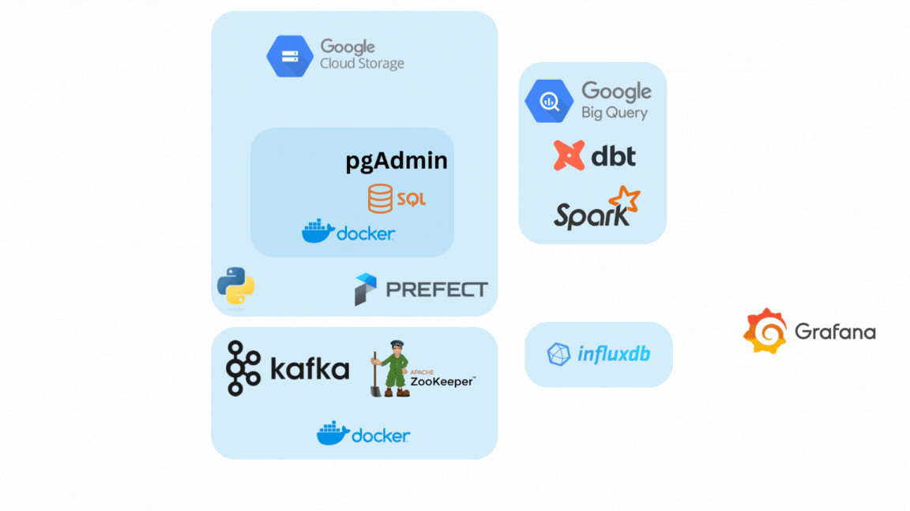

# From Data to Insights: Building a Data Engineering Pipeline Analyzing BayWheels Bike Data

This project focuses on building a data engineering pipeline to analyze BayWheels bike data. The pipeline leverages several key tools and technologies to automate data ingestion, transformation, and analytics.

## Key Features

- **Data Ingestion**: Using Docker, PostgreSQL, and pgAdmin to ingest BayWheels trip data.
- **Orchestration**: Automating workflows with Prefect.
- **Storage and Analytics**: Ingesting data into Google Cloud Storage (GCS) and querying with BigQuery.
- **Streaming**: Real-time streaming of BayWheels trip data using Kafka.
- **Data Visualization**: Google Looker dashboard to analyze and visualize trip data.

## Tools Used

- Docker & Docker Compose
- PostgreSQL & pgAdmin
- Google Cloud Storage (GCS)
- BigQuery
- Kafka
- Prefect
- Google Looker

## Future Enhancements

- Incorporate InfluxDB and Grafana for real-time data monitoring.
- Expand data transformations with dbt and Apache Spark.

## License

This project is licensed under the MIT License.
